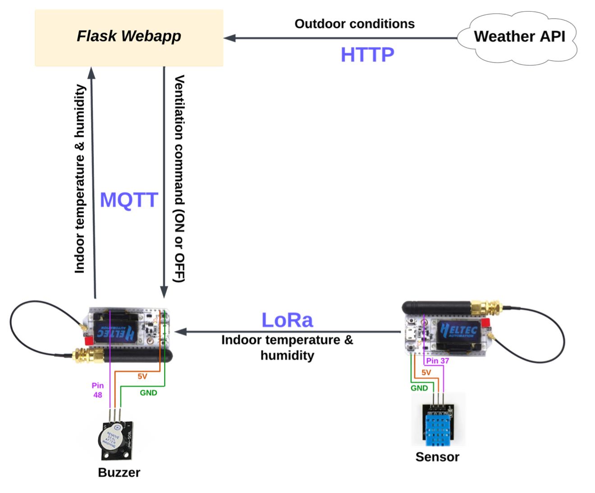
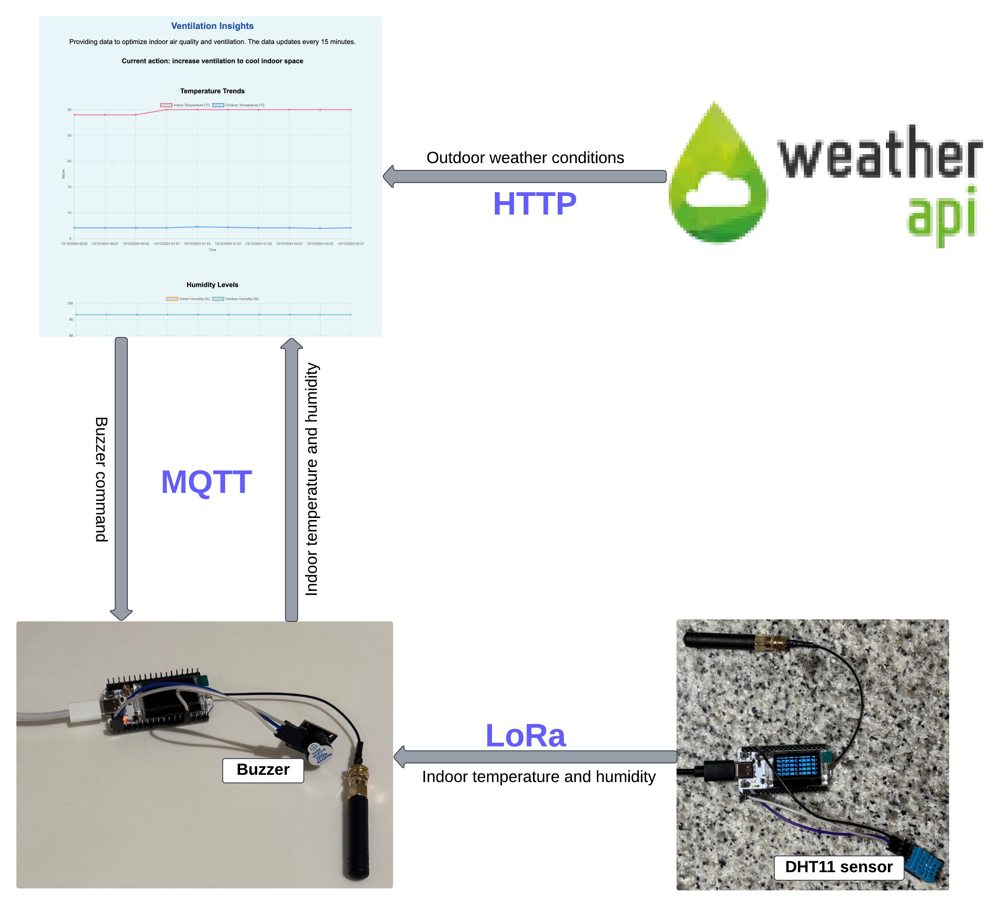

# Smart Ventilation System

## Overview

The **Smart Ventilation System** is an IoT-based solution aimed at improving indoor air quality and enhancing energy efficiency. The system leverages real-time data and predicted particulate matter (PM2.5) levels to send ventilation control commands. It is designed to make decisions based on a combination of a sensor, API, and data analysis. Due to hardware limitations, it currently uses a buzzer to emit different signals instead of more complex actuators.

# Project Structure

This repository contains the code and resources for the Smart Ventilation System project. Below is an explanation of each folder and file in the repository.

## Folders

### `data_collection_phase/`
This folder contains the files related to the initial data collection phase of the project. It contains the python and C++ code used to log API data and sensor data over 8 days, as well as the python code that was used to analyse the data and develop the PM2.5 prediction model.

### `templates/`
Contains the index.html template file used by the Flask web application. This template is rendered by the web app to display dynamic content to the user.

### `Connect_webapp_and_ESP32/`
This folder contains the C++ code that facilitates communication between the ESP32 microcontroller and the web application via MQTT. The code allows the microcontroller to send sensor data to the web app, while also receiving commands from the web app to control the buzzer based on air quality decisions.  

## Files

### `app.py`
The main Flask application that controls the web server. It handles requests, renders templates, communicates with the ESP32 via MQTT, and displays real-time data and analytics on the web interface.

### `random_forest_model.joblib`
A pre-trained random forest machine learning model saved using the `joblib` library. This model is used to predict air quality and help in decision-making regarding ventilation control.

### `requirements.txt`
This file lists the Python libraries required to run the project. It allows users to easily install the necessary dependencies using `pip`.

### `utils.py`
A Python utility script that contains helper functions used throughout by the app.py script.  

## Features
- **Air Quality Monitoring**: The system collects data from both indoor sensor and API to monitor air quality in real-time. This includes indoor and outdoor temperature and humidity, outdoor particulate matter (PM2.5, PM10), CO2, NO2 and O3 levels, and wind speed.
  
- **Automated Control**: Based on the collected data, the system makes real-time decisions on whether to open or close windows to optimize air quality and temperature.  

- **Energy Efficiency**: The system could help minimize energy consumption by controlling ventilation and reducing the need for heating or cooling based on environmental conditions.

- **Healthier environment**: The system aims to reduce pollutants that affect indoor air quality.

## How It Works

- The first ESP32 reads data from the sensors and sends it to the second ESP32 via LoRa.
- The second ESP32 sends the data to the web app via MQTT.
- The web app processes the data, fetches additional data from the weather API, and makes decisions on how to control the ventilation system.
- The decisions are sent back to the second ESP32, which uses a buzzer to signal appropriate actions based on the web app's feedback.

## System Components

1. **DHT11 Sensor**  
  
2. **2 ESP32 Microcontrollers**  

3. **Flask Web App**  

5. **Buzzer**  

## Technologies Used

- **ESP32 Microcontrollers**: Serve as central units for collecting and transmitting sensor data and controlling the buzzer. 
- **DHT11 Sensor**: measures the indoor temperature and humidity.
- **LoRa Communication**: Used for low-power, long-range transmission of sensor data from one ESP32 to the other.
- **MQTT**: A lightweight messaging protocol that enables communication between the second ESP32 microcontroller and the web app.
- **Web App**: The front-end and back-end code that fetches and processes sensor and Weather API data, making decisions about ventilation control.
- **Buzzer**: An actuator used to provide feedback based on the system's decisions, alerting users to change ventilation.
- **Power Supply**: A stable power source, such as USB or battery, for powering the ESP32 modules and sensors.

 
## Use Cases
- **Smart Homes**: homeowners who want to optimize indoor air quality and energy efficiency while reducing reliance on HVAC systems.
- **Nursing Homes**: nursing homes and elderly care facilities, where maintaining a clean and healthy indoor environment is crucial for residents' health and comfort.
- **Offices**: Businesses that want to enhance employee health and comfort by improving air quality and energy use efficiency.
- **Health-Related Applications**: Particularly useful for individuals with respiratory issues or allergies, as it automatically ensures a healthier indoor environment by controlling ventilation based on real-time air quality data.

## Conclusion
The Smart Ventilation System optimizes indoor air quality by leveraging real-time data analysis and automation. Through this IoT setup, ventilation is controlled efficiently, ensuring a healthier indoor environment with minimal energy usage.

For any further information, questions, or collaboration inquiries, feel free to contact us!

---

*This project was developed as part of an IoT coursework project to automate smart home environments using real-time sensor and API data and intelligent decision-making.* 

