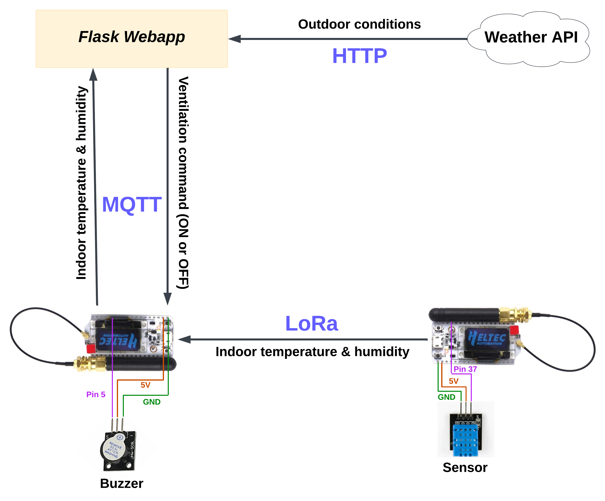

# Smart Ventilation System

## Overview

The **Smart Ventilation System** is an IoT-based solution aimed at improving indoor air quality and enhancing energy efficiency by automatically managing ventilation. The system leverages real-time data and predicted particulate matter (PM2.5) levels to send ventilation control commands. While the system is designed to make decisions based on a combination of a sensor, API, and data analysis, due to hardware limitations, it currently uses a buzzer to emit different signals instead of more complex actuators.

## Features
- **Air Quality Monitoring**: The system collects data from both indoor and outdoor sensors to monitor air quality in real-time. This includes indoor and outdoor temperature and humidity, outdoor particulate matter (PM2.5, PM10), CO2, NO2 and O3 levels, and wind speed.
  
- **Automated Control**: Based on the collected data, the system makes real-time decisions on whether to open windows or close windows to optimize air quality and temperature.  

- **Data Fusion**: The system integrates data from 2 sources (an indoor sensor and an API), processes it, and makes decisions on actuator controls. This ensures an optimized living environment with minimal human intervention.

- **Energy Efficiency**: The system can help minimize energy consumption by controlling ventilation and reducing the need for heating or cooling based on environmental conditions.

- **Healthier environment**: The system aims to reduce pollutants that affect indoor air quality.

## How It Works

- The first ESP32 reads data from the sensors and sends it to the second ESP32 via LoRa.
- The second ESP32 sends the data to the web app via MQTT.
- The web app processes the data, fetches additional information, and makes decisions on how to control the ventilation system.
- The decisions are sent back to the second ESP32, which uses a buzzer to signal appropriate actions based on the web app's feedback.

  

## System Components

1. **Sensors**  
   The system uses sensors such as particulate matter (PM) sensors and temperature sensors to monitor both indoor and outdoor air conditions. Data from these sensors is collected by one ESP32 microcontroller, which sends the data via LoRa to the other ESP32 microcontroller.

2. **Microcontroller (ESP32)**  
   The receiving ESP32 processes the sensor data and sends it to the web app via MQTT. After the web app analyzes the data and makes a decision, it sends the response back to the ESP32, which uses the feedback to control the buzzer and adjust the ventilation system accordingly.

3. **Web App**  
   The web app receives the sensor data from the ESP32, fetches additional data via an API (e.g., weather or air quality), and makes decisions based on the current environmental conditions. These decisions are then sent back to the ESP32 microcontroller, which controls the buzzer or adjusts the system as needed.

4. **Real-time Adjustment**  
   The system continuously monitors both indoor and outdoor conditions, adjusting ventilation and buzzer signals to maintain optimal air quality and energy efficiency. The real-time adjustments help ensure that the indoor environment remains comfortable and well-ventilated.

5. **Buzzer Feedback**  
   Due to hardware limitations, a buzzer is used to provide feedback based on decisions made by the web app. The buzzer signals various states, such as poor air quality or optimal conditions, ensuring that users are alerted to important changes in their environment.

 
## Technologies Used

- **ESP32 Microcontroller**: Serves as the central unit for collecting sensor data and controlling the system. It communicates with the other ESP32 over LoRa and interacts with the web app via MQTT.
- **Sensors**: Particulate Matter (PM2.5, PM10), CO2, and temperature sensors are used to gather environmental data, including indoor and outdoor air quality.
- **LoRa Communication**: Used for low-power, long-range transmission of sensor data from one ESP32 to the other.
- **MQTT**: A lightweight messaging protocol that enables communication between the second ESP32 microcontroller and the web app, which processes the data and sends control signals.
- **Web App**: A server-based application that fetches additional data (e.g., weather, air quality) via APIs and makes decisions on how to control the system based on the incoming sensor data.
- **Buzzer**: An actuator used to provide feedback based on the system's decisions, alerting users to changes in air quality or system status.
  
## Installation

### Hardware Requirements:
- **ESP32 Microcontroller (x2)**: One for reading and sending data, and another for receiving data and communicating with the web app.
- **PM2.5/PM10 Sensors**: To monitor particulate matter levels in the air.
- **CO2 Sensor**: To monitor carbon dioxide levels in the indoor environment.
- **Temperature and Humidity Sensor**: To measure the indoor climate conditions.
- **LoRa Module**: For long-range wireless communication between the two ESP32 microcontrollers.
- **Buzzer**: For providing feedback based on system decisions (e.g., air quality alerts).
- **Power Supply**: A stable power source, such as USB or battery, for powering the ESP32 modules and sensors.
  
### Software Requirements:
- **PlatformIO or Arduino IDE**: Development environments for programming the ESP32 microcontrollers.
- **MQTT Broker**: A server to handle the communication between the ESP32 and the web app.
- **Web App**: The front-end and back-end code that fetches and processes sensor data, making decisions about ventilation control.

### Setup Steps:
1. **Install Libraries**: Install necessary libraries for ESP32, LoRa communication, and MQTT.
2. **Configure ESP32**: Program the ESP32 microcontrollers to read sensor data, communicate with each other via LoRa, and send the data to the web app via MQTT.
3. **Set Up MQTT Broker**: Set up an MQTT broker to facilitate communication between the ESP32 and the web app.
4. **Web App Setup**: Develop or deploy a web app that processes incoming data and makes decisions about ventilation control.
5. **Test the System**: Power up the hardware, test communication between the devices, and verify that the system makes correct decisions based on the data.

### Software Requirements:
- **Arduino IDE or PlatformIO**: For programming the ESP32 microcontrollers.
- **Python**: For data analysis, decision-making, and handling predictions of air quality.
- **MQTT Broker**: For facilitating communication between the ESP32 and the web app.
- **Flask/Django (Optional)**: If you choose to build a web interface to monitor the system performance and adjust settings.
  
### Steps:
1. **Install Required Libraries**: Install necessary libraries for ESP32, LoRa communication, and MQTT in your development environment.
2. **Connect the ESP32 to Sensors**: Wire up sensors (PM2.5, PM10, CO2, temperature) to the ESP32 to read environmental data.
3. **Program the ESP32**: Upload the code using Arduino IDE or PlatformIO to read data from the sensors, send it to the other ESP32 via LoRa, and interact with the web app via MQTT.
4. **Set Up the MQTT Broker**: Set up the MQTT broker to facilitate communication between the ESP32 microcontroller and the web app.
5. **Web App Development (Optional)**: Develop or deploy a web app that processes incoming data, fetches external API data, and makes decisions based on the data received.
6. **Test the System**: Power up the hardware, test communication between devices, and ensure the system can make accurate decisions based on the collected sensor data.

## Use Cases

- **Smart Homes**: Perfect for homeowners who want to optimize indoor air quality and energy efficiency while reducing reliance on HVAC systems.
- **Offices**: Businesses can implement the system to enhance employee health and comfort by improving air quality and energy use efficiency.
- **Health-Related Applications**: Particularly useful for individuals with respiratory issues or allergies, as it automatically ensures a healthier indoor environment by controlling ventilation based on real-time air quality data.

## Conclusion
The Smart Ventilation System optimizes indoor air quality by leveraging real-time data analysis and automation. Through this IoT setup, ventilation is controlled efficiently, ensuring a healthier indoor environment with minimal energy usage.

For any further information, questions, or collaboration inquiries, feel free to contact us!

---

*This project was developed as part of an IoT coursework project to automate smart home environments using real-time sensor and API data and intelligent decision-making.* 

